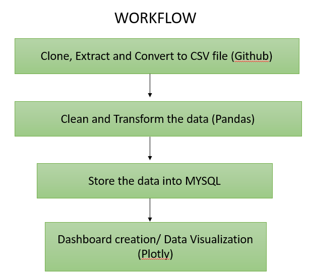

# Phonepe Pulse Data Visualization and Exploration.
PhonePe Pulse is a feature offered by the Indian digital payments platform called PhonePe.
PhonePe Pulse provides users with insights and trends related to their digital transactions and usage patterns on the PhonePe app. It offers personalized analytics, including spending patterns, transaction history, and popular merchants among PhonePe users.
This feature aims to help users track their expenses, understand their financial behavior, and make informed decisions.

## Phonepe Pulse Data Visualisation:
Data visualization refers to the graphical representation of data using charts, graphs, and other visual elements to facilitate understanding and analysis

These visualizations are designed to present information in a visually appealing and easily digestible format, enabling users to quickly grasp trends, patterns, and insights from their transaction history.

## Problem Statement:
The Phonepe pulse Github repository contains a large amount of data related to
various metrics and statistics.The goal is to extract this data and process it to obtain
insights and information that can be visualized in a user-friendly manner.
PROJECT DESCRIPTION:
          Youtube-Data-Harvesting-And-Warehousing YouTube Data Harvesting and Warehousing is a project that intends to provide users with the ability to access and analyse data from numerous YouTube channels. SQL, MongoDB, and Streamlit are used in the project to develop a user-friendly application that allows users to retrieve, save, and query YouTube channel and video data.
          This project aims to develop a user-friendly Streamlit application that utilizes the Google API to extract information on a YouTube channel, stores it in a SQL database, and enables users to search for channel details and join tables to view data in the Streamlit app.

## WORKFLOW:

1. DATA EXTRACTION :  Clone the Phonepe pulse data from Github repository and store it in a suitable format such as CSV or JSON.

2. DATA TRANSFORMATION :
    ---> Use a pandas library to manipulate and pre-process the data.
    ---> Clean the extracted data and then Convert it to dataframe using Pandas.
   
3. MIGARTE TO MYSQL : Migration of data to a MYSSQL database for storing the transformed data.
4. DASHBOARD CREATION: Use the 'Streamlit and PLotly' libraries in Python to create an interactive and visually appealing dashboard.
5. DATA VISUALIZATION : Using 'mysql-connector-python' library to connect to the MySQL database and fetch the data into a Pandas dataframe to update the dashboard dynamically.

TOOLS AND LIBRARIES USED:
 1. PYTHON -> Python is a powerful programming language renowned for being easy to learn and understand. Python is the primary language employed in this project for the development of the complete application, including data retrieval, processing, analysis, and visualisation.
 2. Github Cloning -> Its primary purpose in this project is to interact with YouTube's Data API v3, allowing the retrieval of essential information like channel details, video specifics, and comments. By utilizing googleapiclient, developers can easily access and manipulate YouTube's extensive data resources through code.
 3. MYSQL SERVER 8.0 -> MYSQL is an open-source relational database management system.organizes data into one or more data tables in which data may be related to each other; these relations help structure the data. SQL is a language that programmers use to create, modify and extract data from the relational database
 4. STREAMLIT -> Streamlit library is a framework used to build a user-friendly UI web application that enables users to interact with the programme and carry out data retrieval and analysis operations.
 5. PANDAS -> Python library used for working with data sets. It has functions for analyzing, cleaning, exploring, and manipulating data. It is used widely for Data collection and manipulation for analytics.
 6. plotly -> open-source library that can be used for data visualization and understanding data simply and easily. Plotly supports various types of plots like line charts, scatter plots, histograms, box plots, etc.

Libraries to import :: git , streamlit , pandas, pymysql, plotly, requests

CONCLUSION:
       The result of this project will be a live geo visualization dashboard that displays information and insights from the Phonepe pulse Github repository in an interactive and visually appealing manner.

